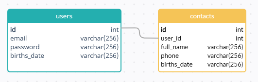

# CRUD app - Notebook
### build on python2.7 + pyqt4
    test project

## Installation and configuration(Linux)

#### Python
    sudo apt install python2

#### PyQt4
    sudo add-apt-repository ppa:rock-core/qt4
    sudo apt-get update

    wget http://archive.ubuntu.com/ubuntu/pool/universe/q/qt-assistant-compat/libqtassistantclient4_4.6.3-7build1_amd64.deb
    wget http://archive.ubuntu.com/ubuntu/pool/universe/p/python-qt4/python-qt4_4.12.1+dfsg-2_amd64.deb
    wget http://archive.ubuntu.com/ubuntu/pool/universe/p/python-pyaudio/python-pyaudio_0.2.11-1build2_amd64.deb

    sudo apt install ./libqtassistantclient4_4.6.3-7build1_amd64.deb ./python-pyaudio_0.2.11-1build2_amd64.deb ./python-qt4_4.12.1+dfsg-2_amd64.deb

#### MariaDB
    sudo apt install python-mysqldb mariadb-server
    
    (connect to db with admin rights)
    CREATE USER 'user'@'localhost' IDENTIFIED BY 'pass';
    CREATE DATABASE 'notebook';
    GRANT ALL PRIVILEGES ON notebook.* TO 'user'@'localhost';

Oops - email не должен содержать кириллицу
